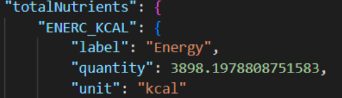

```{r setup, include=FALSE}
knitr::opts_chunk$set(echo = TRUE)
```

# The healthiest diet: a comparison of recipes of various diets to what is universal perceived as healthy in terms of macronutrients #

## 1. Motivation ##
### 1.1 For what purpose was the dataset created? Was there a specific task in mind? Was there a specific gap that needed to be filled? Please provide a description. ### 

Consuming a healthy diet throughout a person’s life helps prevent malnutrition in all its forms as well as a range of diet-related conditions and diseases (WHO, 2019). Recently, there are many diets, all promising to offer the best and healthiest recipes to nourish a human body. While these recipes often include information on the nutritional value of these meals, the question remains whether following these diets is really healthy and meets the recommended daily intake of nutrition. Therefore, there is a gap between the information of these diets and the recommended daily intake of nutrition.                                                                                                                                                               According to  Cena and Calder (2020), a healthy diet consists of meals in which macronutrients are consumed in appropriate proportions to support physiological and energetic needs of the body. Macronutrients (i.e., fats, proteins and carbohydrates) provide the necessary energy for daily functioning. On the other hand, micronutrients (i.e., vitamins and minerals) are required in relatively small amounts for normal metabolism, development, growth and physiological functioning. The macronutrients carbohydrates, fats and proteins are the three main sources of energy in food. Most carbohydrates are broken down in glucose and are the body’s primary energy source. Fat aids in the integrity of cell membranes, the storage of energy, the protection of organs, the production of certain hormones, and the absorption of fat-soluble vitamins. The main role of protein is to maintain lean body mass, develop new tissues, and repair existing ones.                                                                                                                                    In terms of macronutrients, numerous diet recommendations have been made to maintain health and prevent diseases (Flat, 2001). According to Ryan-Harshman & Aldoori (2006), most dietary references suggest that adults should consume 45% to 65% of their calories from carbohydrates, 20% to 35% from fat, and 10% to 35% from protein. Consumers can use these ratios to compare the diets, with corresponding recipes from our dataset.The aim of this project is to create a dataset comparing different diets according to the macronutrients of the diet’s recipes. Researchers can use this dataset to study the effect of certain diets on the health of consumers. Furthermore, marketeers can use the outcomes to discover patterns of macronutrients in the recipes of diets. This may help in improving the STP (Segmentation, Targeting, and Positioning) strategy of food manufacturing companies.

### 1.2 Who created this dataset (e.g., which team, research group) and on behalf of which entity (e.g., company, institution, organization)? ###

The dataset is created by team 12 from the course of Online Data Collection and Management of the master Marketing Analytics of Tilburg University. The team consist of the following members; Anouk Bor, Bi Xuan Guo, Mandana Khabbazi and Indi Wieggers. The instructor for the course and the project is Hannes Datta. 

### 1.3 Who funded the creation of the dataset? If there is an associated grant, please provide the name of the grantor and the grant name and number. ###

This dataset was not created with funding from any organization or individual. Due to this fact, the data extraction code and datasets created by this team are entirely autonomous and made available to the public.


## 2. Composition ##
### 2.1 What do the instances that comprise the dataset represent (e.g., documents, photos, people, countries)? Are there multiple types of instances (e.g., movies, users, and ratings; people and interactions between them; nodes and edges)? Please provide a description. ###

Each instance in the dataset is a dinner recipe. These recipes will be categorized into the five most popular diets for the users from Edamam. The users who use the Edamam site the most are from Canada, Germany, France, the United Kingdom and India. Therefore the following five recipes will make the categorization; Keto diet, Mediterranean diet, Paleo diet, DASH diet and Vegan diet. These diets are the overall most popular in the countries stated above. The diets have multiple types of instances, namely the macronutrients. Those are categorized as fat, protein and carbs. For each recipe, the macronutrients are listed in the database.

### 2.2 How many instances are there in total (of each type, if appropriate)? ###
For all 5 recipes, there is a different number of recipes available. Table 1 below shows a calculation of the total number of recipes from which data is collected. The total number of instances in the dataframe are 34,898 in the latest API from Edamam. However, if the API changes, the number of instances can be altered. The API from Edamam has a limitation of maximum 10,000 calls a month and 10 calls per minute. One call from the Edamam API retrieves 20 recipes. Therefore, you will need 34,898/20 = 1744.9 requests to get data of all 5 recipes. Due to the limitation of the API, you need 1744.9/10/60 = 2.9 hours to gather all data. Since the number of requests required does not exceed the limit of 10,000 calls per month, the data can be easily collected with a single API key.


```{r echo=FALSE}
library(Matrix)
tab <- matrix(c(2323, 10000, 10000, 4635, 7940, 34898), ncol=1, byrow=TRUE)
colnames(tab) <- c('Numer of recipes available')
rownames(tab) <- c('Keto', 'Vegan', 'Dash', 'Mediterranean', 'Paleo', 'Total number of instances')
tab <- as.table(tab)
tab
```

### 2.3 Does the dataset contain all possible instances or is it a sample (not necessarily random) of instances from a larger set? If the dataset is a sample, then what is the larger set? Is the sample representative of the larger set (e.g., geographic coverage)? If so, please describe how this representativeness was validated/verified. If it is not representative of the larger set, please describe why not (e.g., to cover a more diverse range of instances, because instances were withheld or unavailable). ###

This dataset is a sample of the entire Edamam recipe API. The Recipe Search API (the endpoint this project uses) contains over 2.3 million recipes. As mentioned, the dataset contains a selection of recipes based on the diets we are interested in. All the recipes of all five diets are collected, which means the sample represents looking at the diets independently. However, the total of 34,898 instances is not representative of the larger set, but this was not the goal of this data collection. The goal is to obtain data from each recipe of each diet independently.


### 2.4 What data does each instance consist of? “Raw” data (e.g., unprocessed text or images) or features? In either case, please provide a description. ###

34,898 instances have been collected for the raw data. The raw data have been saved into a .json output to be further processed. 

The code in the repository creates a dataset with for every recipe the health label, meal type, dish type, cuisine type and the accompanying macro-nutrients. The macro-nutrients are given in integer variables, this is so users are able to calculate with the numbers. The following tables give an explicit overview of the variables used in the code. 

TABELLEN INVOEGEN --> DOE IK VANAVOND


```{r}
```

### 2.5 Is there a label or target associated with each instance? If so, please provide a description. ###
hits of recipe???? 

### 2.6 Is any information missing from individual instances? If so, please provide a description, explaining why this information is missing (e.g., because it was unavailable). This does not include intentionally removed information, but might include, e.g., redacted text. ###

There is no information missing, however, the number of calories in some recipes seems to be wrong. The number seems oddly high. See the figure below for an example. Additionally, the data does not include a serving size, which could diminish the number of calories per serving. Thus, after checking the original source of the recipes there can be assumed that the information is not accurate, which means the number of calories is removed when collecting data from the API.



### 2.7 Are relationships between individual instances made explicit (e.g., users’ movie ratings, social network links)? If so, please describe how these relationships are made explicit. ###

The relationships between individual instances are made explicit by the link of the recipe to the original site from which the API gathered the information. These instances are identified under *source* and the link to the website under *url*. 

### 2.8 Are there any recommended data splits (e.g., training, development/validation, testing)? If so, please provide a description of these splits, explaining the rationale behind them. ###

The .json file contains all the collected raw data. A recommended data split could be based on the quantity for the macronutrients based on specific diets users are following. Another split could be based on certain cuisine types users prefer. Other splits are also possible, the splits stated above are however recommended by the makers of the database with the thought in mind for the purpose of this dataset. 

### 2.9 Is the dataset self-contained, or does it link to or otherwise rely on external resources (e.g., websites, tweets, other datasets)? If it links to or relies on external resources, a) are there guarantees that they will exist, and remain constant, over time; b) are there official archival versions of the complete dataset (i.e., including the external resources as they existed at the time the dataset was created); c) are there any restrictions (e.g., licenses, fees) associated with any of the external resources that might apply to a future user? Please provide descriptions of all external resources and any restrictions associated with them, as well as links or other access points, as appropriate. ###

Each instance in the Edamam API is linked to an external source, which is a website URL. There is no guarantee that the external websites will keep existing over time, yet, all relevant information is already in the dataset. This means that in case of removal of an external source, there will be no data lost from the API. Moreover, the data that is collected and that is in the output table relies completely on the Edamam API.

### 2.10 Does the dataset contain data that might be considered confidential (e.g., data that is protected by legal privilege or by doctor-patient confidentiality, data that includes the content of individuals non-public communications)? If so, please provide a description. ###

This dataset does not contain data that one could consider confidential. This is based on the fact that the data is publicly available on the Edamam API website. There is no information in the data that could trace back to private information (personal data, locations etc.)

### 2.11 Does the dataset contain data that, if viewed directly, might be offensive, insulting, threatening, or might otherwise cause anxiety? If so, please describe why. ###

The dataset does not contain data that could be considered offensive, insulting, or threatening. The only thing that the dataset contains is information about precise food measures, which might trigger feelings for people with an eating disorder. There is a possibility that the information can cause feelings of anxiety for this group of people.

### 2.12 Does the dataset relate to people? If not, you may skip the remaining questions in this section. ###

The dataset does not relate to people. Therefore, questions 2.12 till 2.15 are not answered and have been removed in the documentation. 

## 3. Collection Process ##
### 3.1 How was the data associated with each instance acquired? Was the data directly observable (e.g., raw text, movie ratings), reported by subjects (e.g., survey responses), or indirectly inferred/derived from other data (e.g., part-of-speech tags, model-based guesses for age or language)? If data was reported by subjects or indirectly inferred/derived from other data, was the data validated/verified? If so, please describe how. ###

The data associated with each instance is acquired through the API from Edamam. The written script creates a .json file with all the raw data for all the 5 recipes. The scrip also creates 5 csv files for each diet to create a clear file t see which recipes belong to the selected diets. 

### 3.2	What mechanisms or procedures were used to collect the data (e.g., hardware apparatus or sensor, manual human curation, software program, software API)? How were these mechanisms or procedures validated? ###

As mentioned in the data collection, the API of Edamam was used to obtain the data of the different recipes of the diets. In order to validate this data, the handful of recipes and their labels and macronutrients were compared to the recipe on the site of Edamam. We also compared the recipe to the original site, which was provided within the API.   

### 3.3 If the dataset is a sample from a larger set, what was the sampling strategy (e.g., deterministic, probabilistic with specific sampling probabilities)? ###

The dataset is a sample from a larger set obtained through deterministic sampling. Based on the site of (PlanKetogenic, z.d.) which contains the most researched diets worldwide, the most popular diets in the countries who use Edamam the most, were chosen and filtered for the dataset. For each diet the dataset is filtered on the macronutrients (fats, carbs and proteins) to be able to see how many grams each recipe contains. The data set is also filtered on lunch/dinner, the reason behind this filter is because people often choose to skip breakfast and intermediate fasting (in which a person consumes their food between 12pm and 8am) has become very popular in the last few years (Mohiuddin, 2018; Snyder, 2022). The cuisine type is also added in order to see from which cuisine the recipe originates.  The dataset has been filtered for the first 8000 diets because the program won't be able to run the script otherwise due to license issues. This makes it however not possible to automate the script. The created csv files for each diets are combined in one final csv file. 

### 3.4	Who was involved in the data collection process (e.g., students, crowdworkers, contractors) and how were they compensated (e.g., how much were crowdworkers paid)? ###

Only the students of this project were involved in the data collection process. The instructor of the project and course did provided help during the data collection. The There was no compensation because this was not applicable to this project. 

### 3.5	Over what timeframe was the data collected? Does this timeframe match the creation timeframe of the data associated with the instances (e.g., recent crawl of old news articles)? If not, please describe the timeframe in which the data associated with the instances was created. ###

The data collected for the project was collected in real time. It is real time collected because it immediately available after collection. The end and total dataset has been collected on the 13th of October. 

### 3.6 Were any ethical review processes conducted (e.g., by an institutional review board)? If so, please provide a description of these review processes, including the outcomes, as well as a link or other access point to any supporting documentation. ###

There were no ethical review processes conducted, therefore, this question is not applicable. 

### 3.7 Does the dataset relate to people? If not, you may skip the remaining questions in this section. ###

The dataset does not relate to people, because the Edamam API does not contain any user information whatsoever. Therefore, the questions in the following section are not applicable. 

## 4. Preprocessing, cleaning, labeling ##
### 4.1 Was any preprocessing/cleaning/labeling of the data done (e.g., discretization or bucketing, tokenization, part-of-speech tagging, SIFT feature extraction, removal of instances, processing of missing values)? If so, please provide a description. If not, you may skip the remainder of the questions in this section. ###

To obtain the final dataset, we carried out several pre-processing steps. First, we collected all recipes from each diet separately. These are stored in the following files: … Then, for each diet, we collected the recipes we were interested in with respect to dinner and dish type.  Finally, a loop was created in which the name of the recipe and the amounts of carbohydrates, fats and proteins were tabulated. Labels were created for mealtype, dish type and cuisine type. There were no missing values in the final data set, so no missing values were removed. As said before, the number of calories didn’t seem correct with the recipes, therefore the number of calories was deleted. The time for the recipe has not been add to the dataset because the main focus for this data set lays on the macronutrients and for users to see how many grams they consume if they make a ceretain recipe. 

### 4.2	Was the “raw” data saved in addition to the preprocessed/cleaned/labeled data (e.g., to support unanticipated future uses)? If so, please provide a link or other access point to the “raw” data. ###

The file ‘X.json’ contains the complete raw data. --> GOEDE NAAM VAN FILE TOEVEOGEN

### 4.3	Is the software used to preprocess/clean/label the instances available? If so, please provide a link or other access point. ###

This project makes no use of any additional tools to preprocess, clean, or label the data.

## 5. Uses ##
### 5.1	Has the dataset been used for any tasks already? If so, please provide a description. ###

### 5.2	Is there a repository that links to any or all papers or systems that use the dataset? If so, please provide a link or other access point. ###

### 5.3	What (other) tasks could the dataset be used for? ###

### 5.4	Is there anything about the composition of the dataset or the way it was collected and preprocessed/cleaned/labeled that might impact future uses? For example, is there anything that a future user might need to know to avoid uses that could result in unfair treatment of individuals or groups (e.g., stereotyping, quality of service issues) or other undesirable harms (e.g., financial harms, legal risks) If so, please provide a description. Is there anything a future user could do to mitigate these undesirable harms? ###

### 5.5	Are there tasks for which the dataset should not be used? If so, please provide a description. ###


