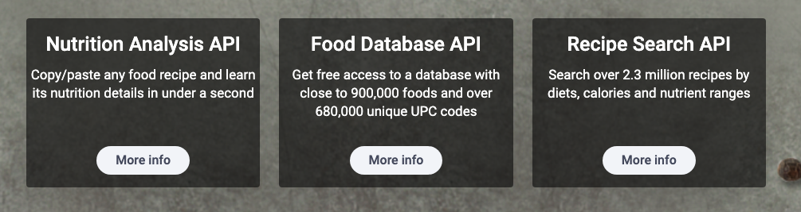
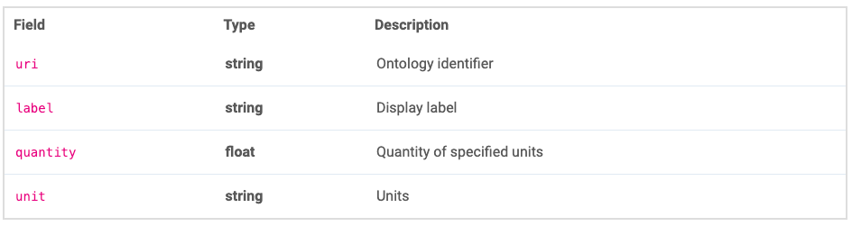
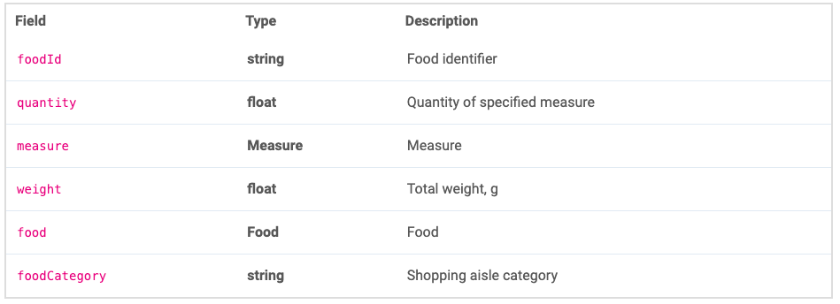
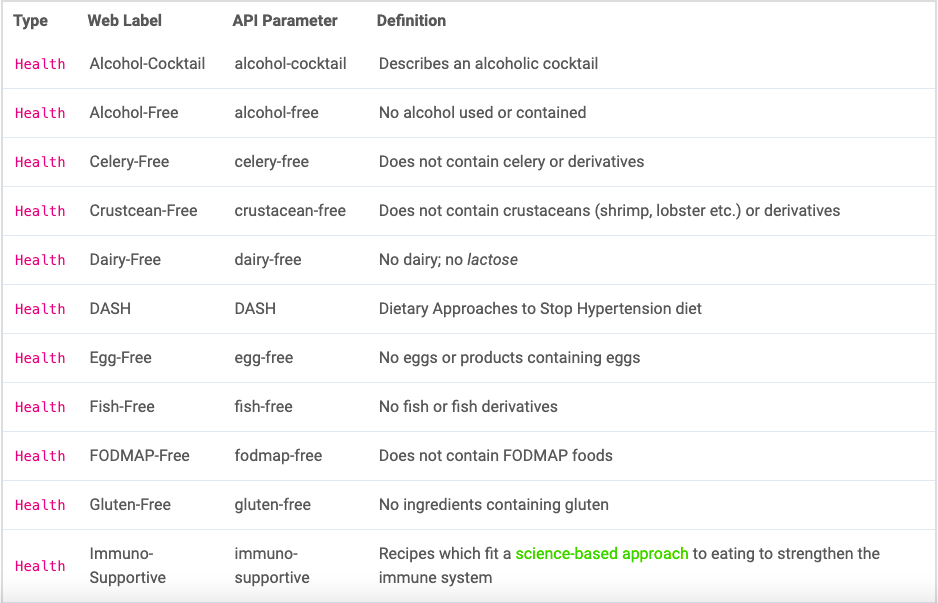
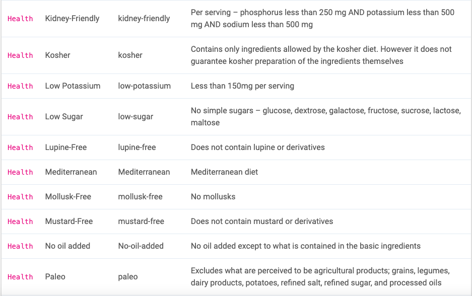
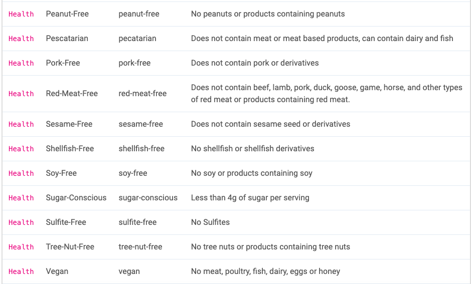
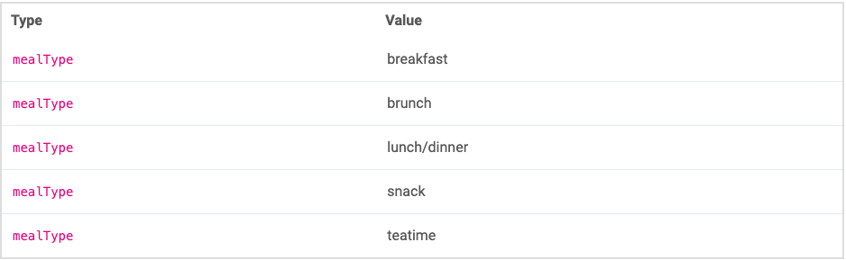
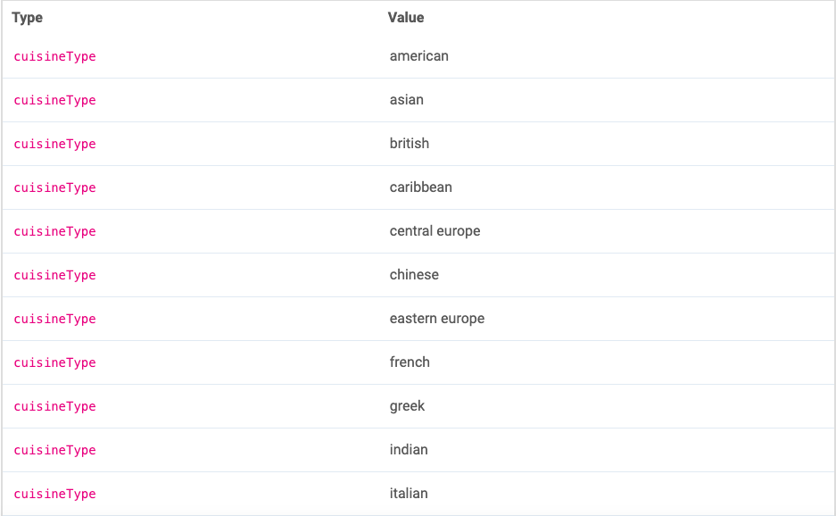
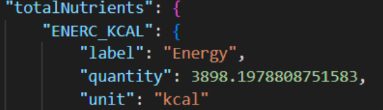
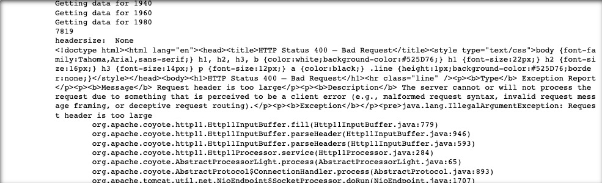

```{r setup, include=FALSE}
knitr::opts_chunk$set(echo = TRUE)
```

# The healthiest diet: a collected dataset of recipes of various diets in terms of macronutrients #

## 1. Motivation ##
### 1.1 For what purpose was the dataset created? Was there a specific task in mind? Was there a specific gap that needed to be filled? Please provide a description. ### 

Consuming a healthy diet throughout a person’s life helps prevent malnutrition in all its forms as well as a range of diet-related conditions and diseases (WHO, 2019). Recently, there are many types of diets available, all promising to offer the best and healthiest recipes to nourish a human body. While these recipes often include information on the nutritional value of these meals, the question remains whether sticking to these diets is really perceived as "healthy" and if using all the recommended recipes would actually provide your body with all the nutrients it needs.

There has been a lot of research and claims about which diet is healthier than the other. When you would break it down by nutrition, according to Cena and Calder (2020), a healthy diet consists of meals in which macronutrients (i.e. fats, proteins and carbohydrates) are consumed in the right proportions to support the body's physiological and energetic needs. Indeed, macronutrients provide the necessary energy for daily functioning. Additionally, micro nutrients (i.e., vitamins and minerals) are required in relatively small amounts for normal metabolism, development, growth and physiological functioning. However, the macronutrients are the three main sources of energy in food (Cena & Calder, 2020). Carbohydrates are mostly broken down in glucose and are the body’s primary energy source. Fat aids in the integrity of cell membranes, the storage of energy, the protection of organs, the production of certain hormones, and the absorption of fat-soluble vitamins. The main role of protein is to maintain lean body mass, develop new tissues, and repair existing ones. In terms of macronutrients, numerous diet recommendations have been made to maintain health and prevent diseases (Flat, 2001). According to Ryan-Harshman & Aldoori (2006), most dietary references suggest that adults in general should consume 45% to 65% of their calories from carbohydrates, 20% to 35% from fat, and 10% to 35% from protein. 

Because of the controversial opinion on which diet is perceived as healthy (and if certain diets are even healthy to follow) the aim of this project is to create a large dataset in which recipes of various diets are displayed with the main macronutrients: carbohydrates, fats and proteins. Researchers can use this dataset to study the effect of certain diets on the health of consumers. Furthermore, marketeers can use the outcomes to discover patterns of macronutrients in the recipes of diets. This may help in improving the STP (Segmentation, Targeting, and Positioning) strategy of food manufacturing companies. Besides that, anyone who is interested in certain diets can extract information through the API about the recipe they are interested in.

When looking for a source to get our data from, we researched several options online. In doing so, we looked at different websites for scrapping, as well as other ways to get data, such as APIs and datasets. We first looked at a very popular food diary app called Myfitnesspal. We tried looking on their website to see if data was publicly available, but we discovered that the data had to be obtained via an API, which is not free. We decided we needed to look wider to find the right data. We looked at other less popular food-tracking apps and websites, such as Fatsecret and Virtuagym, but we discovered that it is very difficult to scrape data from food-tracking apps, because the data is linked to personal data, and thus privacy issues can arise.

With this, we decided to include APIs and datasets and look at less popular food-tracking/nutritional websites from the Netherlands. Our idea was that here we would have a higher chance that the API would be publicly available. We found several websites, but some had too few recipes available or no nutritional information. Eventually, it led us to the website https://www.edamam.com/, which has a large food database and recipe API. We searched the website on Google Trends and found that the website is most popular in France and the US. We searched further and discovered that it is possible to get free access to the API (https://developer.edamam.com/edamam-recipe-api) as a developer. In our case, we thought it would be easier to use the API as it saves time and avoids legal problems. Edamam's Recipe Search API is the endpoint used by this project. It is the only endpoint because it contains enough data that we want to collect. Table 1 gives a brief overview of the data sources, including the requirements we looked at.

```{r table1, echo=FALSE, message=FALSE, warnings=FALSE, results='asis'}
tabl <- "
Table: Overview of data sources.

| Data source | Data extraction | Free access | Sufficient number of recipes available | Nutrition information available
|--------------------|:-------:|:------:|:-----------:|:-----------:|
| https://www.taste.com/ | Web scraping | Yes | No | Yes |
| https://www.themealdb.com/ | API | Yes | No | No |
| https://zestfuldata.com/ | API | Not for recipes | Yes | No |
| https://tasty.co/ | Web scraping | Yes | Yes | Yes |
| https://www.edamam.com/ | API | Yes | Yes | Yes |
| https://www.yummly.com/ | API | No | Yes | Need premium account |
| https://www.bigoven.com/ | Web scraping | Yes | Yes | Need premium account |
| https://www.fatsecret.com/ | API | Yes | No | Yes, but only per product |
| https://www.nutritionix.com/ | API | Yes | No | Yes, but only per product |
| https://www.hellofresh.com/ | Web scraping | Yes | Hard to filter per diet | Yes |
"
cat(tabl)
```

### 1.2 Who created this dataset (e.g., which team, research group) and on behalf of which entity (e.g., company, institution, organization)? ###

The dataset is created by team 12 from the course of Online Data Collection and Management of the master Marketing Analytics of Tilburg University. The team consist of the following members; Anouk Bor, Bi Xuan Guo, Mandana Khabbazi and Indi Wieggers. The instructor for the course and the project is Hannes Datta. 

### 1.3 Who funded the creation of the dataset? If there is an associated grant, please provide the name of the grantor and the grant name and number. ###

This dataset was not created with funding from any organization or individual. Due to this fact, the data extraction code and datasets created by this team are entirely autonomous and made available to the public.

## 2. Composition ##
### 2.1 What do the instances that comprise the dataset represent (e.g., documents, photos, people, countries)? Are there multiple types of instances (e.g., movies, users, and ratings; people and interactions between them; nodes and edges)? Please provide a description. ###

Each instance in the dataset is a lunch/dinner recipe. These recipes are categorised into the five most popular diets for the users from https://www.edamam.com/. The users who use the Edamam site most frequently are located in Canada, Germany, France, the United Kingdom and India. The following diets are generally the most popular in the above countries (more on this in section 3.3); Keto diet, Mediterranean diet, Paleo diet, DASH diet and Vegan diet. The diets have multiple types of instances, including the macronutrients. These are categorized as fat, protein and carbohydrates (carbs). For each recipe, the macronutrients are listed in the database.

### 2.2 How many instances are there in total (of each type, if appropriate)? ###
Different numbers of recipes are available for all five diets. Table 2 shows a calculation of the total number of recipes from which data is collected. The total number of instances in the dataframe is 34,898 in Edamam's latest API. However, if the API changes, the number of instances can be altered. The API from Edamam has a limitation of a maximum of 10,000 calls per month and 10 calls per minute. One call from the Edamam API retrieves 20 recipes. Therefore, it takes 34,898/20 = 1744.9 requests to retrieve the data of all five diets. Due to the limitation of the API, it takes 1744.9/10/60 = 2.9 hours to gather all data. Since the number of requests required does not exceed the limit of 10,000 calls per month, the data can be easily collected with a single API key.

```{r table2, echo=FALSE, message=FALSE, warnings=FALSE, results='asis'}
tabl <- "
Table: Number of instances.

|                           | Number of recipes available |
|---------------------------|:---------------------------:|
| DASH                      | 10000                       |
| Keto                      | 2323                        |
| Mediterranean             | 4635                        |
| Paleo                     | 7940                        |
| Vegan                     | 10000                       |
| Total                     | 34898                       |
"
cat(tabl)
```

### 2.3 Does the dataset contain all possible instances or is it a sample (not necessarily random) of instances from a larger set? If the dataset is a sample, then what is the larger set? Is the sample representative of the larger set (e.g., geographic coverage)? If so, please describe how this representativeness was validated/verified. If it is not representative of the larger set, please describe why not (e.g., to cover a more diverse range of instances, because instances were withheld or unavailable). ###

This dataset is a sample of the entire Edamam recipe API. The Recipe Search API contains over 2.3 million recipes. As mentioned earlier, the dataset only contains recipe information from the diets we are interested in. All recipes of the five diets are collected, which means that the sample represent each diet independently. The total of 34,898 instances is not representative of the total Recipe Search API of 2.3 millions recipes. However, this was also not the purpose of this data collection. In fact, the aim was to obtain data from each recipe of each diet separately.



### 2.4 What data does each instance consist of? “Raw” data (e.g., unprocessed text or images) or features? In either case, please provide a description. ###

For the raw data, 34,898 instances were collected. The raw data was stored in a .json output for further processing. Table 3 contains the descriptive statistics of the diets.

```{r table3, echo=FALSE, message=FALSE, warnings=FALSE, results='asis'}
tabl <- "
Table: Descriptive statistics diets.

| Diet type     | Mean carbs | SD carbs | Mean fats | SD fats | Mean protein |  SD protein |
|---------------|:----------:|:--------:|:---------:|:-------:|:------------:|:-----------:|
| DASH          | 161        | 206      | 101       | 134     | 69.3        | 91.5 |
| Keto          | 58         | 78.1     | 153       | 116     | 101         | 98.9 |
| Mediterranean | 153        | 165      | 101       | 97      | 101         | 93.9 |
| Paleo         | 130        | 161      | 136       | 135     | 88.7        | 97.8 |
| Vegan         | 254        | 223      | 103       | 120     | 56.2        | 47.2 |
"
cat(tabl)
```

The code in the repository creates a dataset containing the health label, meal type, cuisine type and corresponding macronutrients for each recipe. The macronutrients are given in integer variables, allowing users to calculate with the numbers. The following tables explicitly list the variables used in the code. 

ADD TABLES

 
 

 
 
 
 
 
 
```{r}
```

### 2.5 Is there a label or target associated with each instance? If so, please provide a description. ###
Each instance, in this case each recipe, is labeled under *hits* and *recipe*. This is the same for each dataset per diet.

### 2.6 Is any information missing from individual instances? If so, please provide a description, explaining why this information is missing (e.g., because it was unavailable). This does not include intentionally removed information, but might include, e.g., redacted text. ###

There is no information missing from individual instances, however, the number of calories in some recipes seems to be wrong. The number seems oddly high (see Figure 2 for an example). Additionally, the data does not include a serving size, which could diminish the number of calories per serving. Thus, after checking the original source of the recipes, it can be assumed that the information is not accurate. Therefore, calorie counts are removed when creating a dataset from the API. This is to avoid spreading inaccurate information about recipes, which may lead to wrong conclusions.



### 2.7 Are relationships between individual instances made explicit (e.g., users’ movie ratings, social network links)? If so, please describe how these relationships are made explicit. ###

The relationships between individual instances are made explicit by the link of the recipe to the original site from which the API retrieved the information. These instances are identified under *source* and the link to the website under *url*. 

### 2.8 Are there any recommended data splits (e.g., training, development/validation, testing)? If so, please provide a description of these splits, explaining the rationale behind them. ###

The .json file contains all the collected raw data. A recommended data split could be based on the amount of macronutrients per recipe based on specific diets that users of the dataset follow. Another split could be based on certain types of cuisines preferred by users. Other splits are also possible, but the above splits are recommended by the dataset creators, taking into account the purpose of this dataset.

### 2.9 Is the dataset self-contained, or does it link to or otherwise rely on external resources (e.g., websites, tweets, other datasets)? If it links to or relies on external resources, a) are there guarantees that they will exist, and remain constant, over time; b) are there official archival versions of the complete dataset (i.e., including the external resources as they existed at the time the dataset was created); c) are there any restrictions (e.g., licenses, fees) associated with any of the external resources that might apply to a future user? Please provide descriptions of all external resources and any restrictions associated with them, as well as links or other access points, as appropriate. ###

Each instance in the Edamam API is linked to an external source, namely a website URL. There is no guarantee that the external websites will persist over time, but all relevant information is present in the dataset. This means that when an external source is removed, no data is lost from the API, because the data collected and the output table are completely dependent on the Edamam API.

### 2.10 Does the dataset contain data that might be considered confidential (e.g., data that is protected by legal privilege or by doctor-patient confidentiality, data that includes the content of individuals non-public communications)? If so, please provide a description. ###

This dataset does not contain data that one could consider confidential. This is based on the fact that the data is publicly available on the Edamam API website. There is no information in the data that could trace back to private information (personal data, locations etc.).

### 2.11 Does the dataset contain data that, if viewed directly, might be offensive, insulting, threatening, or might otherwise cause anxiety? If so, please describe why. ###

The dataset does not contain data that could be considered offensive, insulting, or threatening. The only thing that the dataset contains is information about precise food measures, which might trigger feelings for people with an eating disorder. There is a possibility that the information can cause feelings of anxiety for this group of people.

### 2.12 Does the dataset relate to people? If not, you may skip the remaining questions in this section. ###

The dataset does not relate to people. Therefore, questions 2.12 to 2.15 were not answered and deleted from the documentation.

## 3. Collection Process ##
### 3.1 How was the data associated with each instance acquired? Was the data directly observable (e.g., raw text, movie ratings), reported by subjects (e.g., survey responses), or indirectly inferred/derived from other data (e.g., part-of-speech tags, model-based guesses for age or language)? If data was reported by subjects or indirectly inferred/derived from other data, was the data validated/verified? If so, please describe how. ###

The data of each instance is directly observable as raw text and accessed using Edamam's API. The entire collection process consists of several steps and is stored in a script with written code in '*src/collection/database_recipe_API.py*.

First, the script creates a .json file that collects all the raw data for a diet. This can be done for any diet, and in this case, five separate .json files are created for the five diets. Next, all the recipes for a diet are extracted using a while loop, ensuring that the code gets 6 seconds of sleep due to the limitation of 10 calls per minute mentioned in section 2.2. After this, the code extracts the macronutrients from all recipes. Again, the sleep time is set to 6 seconds because of the limitation. In addition, the script creates a separate CSV file to have a clear overview of the macronutrient information for each recipe. Once more, separate files are created for each diet, creating a total of five CSV files to see which recipe belongs to which diet. To put everything together, the code merges the different CSV files into one big CSV file with information from all five diets. Finally, the "pandas" package was used to structure the data into a large table (dataframe) with all variables of interest.

Note that the script can specify which diets the data is scraped from. The number of diets scraped therefore depends on what the user of this scraper is interested in, so the number of CSV files generated may also vary.

Unfortunately, our team encountered technical problems when scaling up the data collection. For each diet, an error appeared for a particular line (in the range of 1275-1754) when trying to extract more data. An example of the error is shown in Figure 3. The debugging phase consisted of looking up the error online, whether other users of this API had the same problems, and trying to parse these specific lines in the .json files. However, we could not figure out what caused this error. Our guess is that it has to do with the output of the .json files becoming too large. Although we failed to collect data from all instances, our dataset is still large enough and contains enough information to use.



### 3.2	What mechanisms or procedures were used to collect the data (e.g., hardware apparatus or sensor, manual human curation, software program, software API)? How were these mechanisms or procedures validated? ###

As mentioned in the data collection, the API of Edamam was used to obtain the data of the different recipes of the diets. In order to validate this data, the different recipes and their labels and macronutrients were compared with the recipe on the site of Edamam. We also compared the recipe with the original site offered within the API.  

We scraped the data using the web application Jupyter Notebooks launched by Anaconda Navigator. Loading the packages requests, json, pandas, pickle, time and os allowed us to use functions that enabled our data collection steps.

### 3.3 If the dataset is a sample from a larger set, what was the sampling strategy (e.g., deterministic, probabilistic with specific sampling probabilities)? ###

The dataset is a sample from a larger set obtained through deterministic sampling. Based on the site of PlanKetogenic (n.d.) that contains the most researched diets worldwide, the most popular diets in the countries that use Edamam the most were chosen and filtered for the dataset. For each diet, the dataset was filtered for the macronutrients fats, carbohydrates and proteins to see how many grams each recipe contains. The data set was also filtered by lunch/dinner. The reason behind this is because intermediate fasting (where someone consumes their food between 12pm and 8am) has become very popular in recent years (Mohiuddin, 2018; Snyder, 2022). This means that people more often choose to skip breakfast, so lunch/dinner seemed a more useful meal type to extract information from. The cuisine type was also added to see which cuisine the recipe came from. The dataset was filtered for the first 8000 diets, as the software programs used (Jupyter Notebook and Anaconda)  could not otherwise run the script due to licensing issues. As a result, it is unfortunately not possible to automate the script. However, the scraper does comment on what one should do to get the CSV file that aggregates the nutritional information of all diets. This also makes it easier for future users of the scraper, as there is a guide on how to add the diets to the scraper one is interested in.

### 3.4	Who was involved in the data collection process (e.g., students, crowdworkers, contractors) and how were they compensated (e.g., how much were crowdworkers paid)? ###

Only the students of this project were involved in the data collection process. The instructor of the project and course did provide assistance during data collection. There was no compensation as this was not applicable to this project.

### 3.5	Over what timeframe was the data collected? Does this timeframe match the creation timeframe of the data associated with the instances (e.g., recent crawl of old news articles)? If not, please describe the timeframe in which the data associated with the instances was created. ###

The data collected for the project was collected in real time. It is real time collected because it immediately available after collection. The final dataset was collected on the 13th of October and is stored in the file 'All_Diets.csv'.

### 3.6 Were any ethical review processes conducted (e.g., by an institutional review board)? If so, please provide a description of these review processes, including the outcomes, as well as a link or other access point to any supporting documentation. ###

There were no ethical review processes conducted. Therefore, this question is not applicable. 

### 3.7 Does the dataset relate to people? If not, you may skip the remaining questions in this section. ###

The dataset does not relate to people, because the Edamam API does not contain any user-specific information whatsoever. Therefore, the questions in the following section are not applicable. 

## 4. Preprocessing, cleaning, labeling ##
### 4.1 Was any preprocessing/cleaning/labeling of the data done (e.g., discretization or bucketing, tokenization, part-of-speech tagging, SIFT feature extraction, removal of instances, processing of missing values)? If so, please provide a description. If not, you may skip the remainder of the questions in this section. ###

As mentioned, raw data was gathered using the API and stored in CSV files. To obtain the final dataset, we carried out several preprocessing steps. First, it is important to note that tokenisation must be used for the API key. The API key contains sensitive data that must be converted into non-sensitive data, called "tokens", to be used in the database without exposing the sensitive information. This was done by configuring environment variables.

There were no missing values in the raw data, so no missing values were removed. As previously explained, calorie counts did not seem reliable, hence they were not included in the dataset. Recipe time was not added to the dataset because the focus of this dataset is on macronutrients and to show users how many grams they consume when making a particular recipe. Therefore, micronutrients were also not included. Labels were created for diet type, recipe name, cuisine type and the amounts of proteins, carbohydrates and fats in grams, respectively. The final dataset consists of merging the different CSV files of the diets, which is stored in the file 'All_Diets.csv'.

### 4.2	Was the “raw” data saved in addition to the preprocessed/cleaned/labeled data (e.g., to support unanticipated future uses)? If so, please provide a link or other access point to the “raw” data. ###

As aforementioned, the raw data for each diet is automatically stored in .json files, alongside the preprocessed/cleaned/labeled data as part of our coding script. This is also particularly useful to support unexpected future applications. The raw data for each diet is stored in a file named '[diet]_raw_data.json'.

### 4.3	Is the software used to preprocess/clean/label the instances available? If so, please provide a link or other access point. ###

For tokenisation and configuring environment variables, the steps were followed in the following link: https://tilburgsciencehub.com/building-blocks/store-and-document-your-data/store-data/environment-variables/. Mac/Linux users should use terminal and accessing the environment variables is possible with Python or R. In addition, Anaconda, Jupiter Notebook and the packages needed for functions to preprocess/clean/label the data are all publicly available.

## 5. Uses ##
### 5.1	Has the dataset been used for any tasks already? If so, please provide a description. ###

The data set has not yet been used for any tasks, but is available for future use.

### 5.2	Is there a repository that links to any or all papers or systems that use the dataset? If so, please provide a link or other access point. ###

There is no repository available yet for papers and systems that use the data scraped in this project. However, we have our repository that contains all the files and the final dataset corresponding to this project. The link to this repository is: https://github.com/Mandanakhabbazi/recipe-nutritions.git

### 5.3	What (other) tasks could the dataset be used for? ###

Researchers can use this dataset to study the effect of the five diets on consumer health. Furthermore, marketeers can use the outcomes to discover patterns of macronutrients in the diets' recipes. This can help improve food producers' STP (Segmentation, Targeting, and Positioning) strategy. Although this dateset focuses only on the diets Keto, vegan, DASH, Mediterranean and Paleo, one can in fact create datasets of any diet one is interested in, as the script allows to define the diet one wants to scrape and is not limited to the five diets used in this project.

### 5.4	Is there anything about the composition of the dataset or the way it was collected and preprocessed/cleaned/labeled that might impact future uses? For example, is there anything that a future user might need to know to avoid uses that could result in unfair treatment of individuals or groups (e.g., stereotyping, quality of service issues) or other undesirable harms (e.g., financial harms, legal risks) If so, please provide a description. Is there anything a future user could do to mitigate these undesirable harms? ###

There is nothing that might impact future uses.

### 5.5	Are there tasks for which the dataset should not be used? If so, please provide a description. ###

While the data set can be used as a dietary guide, it should not be used as a sole guideline, as it focuses only on the macro-nutrients carbohydrates, fats and proteins. Moreover, consumers cannot tell from our dataset how many calories are in a serving of a recipe. In addition, the amounts of vitamins and minerals are also not listed with the recipes, even though they contribute a lot to a person's health.

## 6. Sources ##

Cena, H., & Calder, P. C. (2020). Defining a healthy diet: evidence for the role of contemporary dietary patterns in health and disease. Nutrients, 12(2), 334.

Flatt, J. P. (2001). Macronutrient composition and food selection. Obesity research, 9(S11), 256S-262S.

Ryan-Harshman, M., & Aldoori, W. (2006). New dietary reference intakes for macronutrients and fibre. Canadian family physician, 52(2), 177.

World Health Organization. (2019). Healthy diet (No. WHO-EM/NUT/282/E). World Health Organization. Regional Office for the Eastern Mediterranean.

New Popular Diet Trends in 2022. (n.d.). Consulted on October 14th 2022, from https://planketogenic.pro/en/blog/most-popular-diets
